# Transformer 学习

## 一、神经网络基础

### 1.1 神经元的本质

✨ **神经元的本质：描述输入和输出关系的数学函数！**

```math
y = \sigma(W \cdot X + b)
```

其中：

* *`W `*为权重矩阵
* *`X`* 为输入矩阵
* *`b`* 为神经元的偏置（如果没有此项，则函数只能拟合`输入为0时，输出也为0` 的线性关系，因此无法拟合任意的线性关系）
* *`σ`* 为激活函数（让网络拥有拟合非线性函数的能力）


✨ **为了让神经网络可以拟合非线性关系的数据，因此可以在每层神经元后面加上一个激活函数，引入非线性！**


✅ 曾经的激活函数之王：Sigmoid


✅ 目前常用的激活函数：Relu


### 1.2 反向传播与梯度下降

> 反向传播 = 计算梯度
>
> 梯度下降 = 根据算出来的梯度去更新模型参数

✨ **函数拟合与梯度下降的关系**

假设有一个任务是根据 `房子的面积` 去预测 `房子的价格`，其实计算输入和输出的函数表达式！


先理解上山，再理解下山！


在二维平面中：

* 可以根据 `导数的正负性`，寻找上山的路！
* 可以直接用 `导数的大小`，作为上山的步长!


特殊情况：


为了解决上述的极端情况，通常会在每次的步长前面乘以一个变量，动态调整每次的步长，这个变量就称为 `学习率`


因此，对于二元函数构成的 3 维空间，要找上山的路，需要对 2 个变量分别求偏导数，这两个偏导数分别对应了 2 个方向上要走的步长


> 上山举例：假设你当前所在的位置为 (1, 2)，当前位置的梯度为（2， 3），则如果你要上山的话，下一步的位置为（3，5）

知道了上山的步骤，下山就更简单了，只需要给梯度乘个-1，让他反方向走，就能一步一步走到最低的点

> 上山举例：假设你当前所在的位置为 (1, 2)，当前位置的梯度为（2， 3），则如果你要下山的话，下一步的位置为（1-2，2-3）


✨ **反向传播：计算模型中所有可学习参数的梯度（偏导数）**

✅ 第一步：搭建神经网络模型


✅ 第二步：前向传播

```math
\begin{align*}
a_1 &= w_1 \cdot x_1 + w_2 \cdot x_2 + b_1 &\quad y_1 &= \frac{1}{1+e^{-a_1}} \\
a_2 &= w_3 \cdot x_1 + w_4 \cdot x_2 + b_2 &\quad y_2 &= \frac{1}{1+e^{-a_2}} \\
a_3 &= w_5 \cdot z_1 + w_6 \cdot z_2 + b_3 &\quad y_3 &= \frac{1}{1+e^{-a_3}}
\end{align*}
```

✅ 第三步：反向传播

**1. 选择合适的损失函数**

`如果每次只训练一个样本，用 MSE 作为损失函数：`

```math
L = \text{MSE} = \frac{1}{2} \left( \hat{y} - y \right)^2 = \frac{1}{2} \left( {y}_3 - y \right)^2
```

* *ŷ*：模型预测值，对应当前模型的 *y~3~*（比如这张图片是狗的概率 = 0.95）
* *y*：真实值（如果这张图片真是狗，则标签为 1，否则标签为 0）
* 1/2：实际的 MSE 是不需要除以 2 的，这里纯粹是为了简化反向传播时的计算


`如果每次训练 N 个样本，用 MSE 作为损失函数：`

```math
L = \text{MSE} =  \frac{1}{N} \sum_{i=1}^{N} \left( \hat{y}_i - y_i \right)^2
```

* *ŷ*：模型预测值
* *y*：真实值
* *N*（batch_size ）：本次训练的样本数量

> 比如：训练数据是 5 套房子的交易信息**（5 个样本，N=5）**，每套房子都用 3 个特征描述**（3 个输入变量，*x*~1~、*x*~2~、*x*~3~）**
>
> 网络会对这 5 个样本分别做前向传播得到 5 个预测值 *ŷ*，再和 5 个真实值 *y* 计算 MSE（除以 5）

**2. 计算所有可训练参数的梯度，即对所有输入变量求偏导**

这个神经网络里所有可训练参数为：权重*w*~1~、*w*~2~、*w*~3~、*w*~4~、*w*~5~、*w*~6~，以及偏置*b*~1~、*b*~2~、*b*~3~）

```math
\begin{cases}
\frac{\partial L}{\partial w_6} = \frac{\partial L}{\partial y_3} \cdot \frac{\partial y_3}{\partial a_3} \cdot \frac{\partial a_3}{\partial w_6} = a \\
\frac{\partial L}{\partial w_5} = \frac{\partial L}{\partial y_3} \cdot \frac{\partial y_3}{\partial a_3} \cdot \frac{\partial a_3}{\partial w_5} = b \\
\frac{\partial L}{\partial w_4} = \frac{\partial L}{\partial y_3} \cdot \frac{\partial y_3}{\partial a_3} \cdot \frac{\partial a_3}{\partial y_2} \cdot \frac{\partial y_2}{\partial a_2} \cdot \frac{\partial a_2}{\partial w_4}= c \\
\frac{\partial L}{\partial w_3} = \dots = d \\
\frac{\partial L}{\partial w_2} = \dots = e \\
\frac{\partial L}{\partial w_1} = \dots = f \\
\end{cases}
```

```math
\begin{cases}
\frac{\partial L}{\partial b_3} = \frac{\partial L}{\partial y_3} \cdot \frac{\partial y_3}{\partial a_3} \cdot \frac{\partial a_3}{\partial b_3} = g \\
\frac{\partial L}{\partial b_2} = \frac{\partial L}{\partial y_3} \cdot \frac{\partial y_3}{\partial a_3} \cdot \frac{\partial a_3}{\partial y_2} \cdot \frac{\partial y_2}{\partial a_2} \cdot \frac{\partial a_2}{\partial b_2}= h \\
\frac{\partial L}{\partial b_1} = \frac{\partial L}{\partial y_3} \cdot \frac{\partial y_3}{\partial a_3} \cdot \frac{\partial a_3}{\partial y_1} \cdot \frac{\partial y_1}{\partial a_1} \cdot \frac{\partial a_1}{\partial b_1}= i
\end{cases}
```

**3. 利用梯度下降法，更新参数**

其中：*α* 为学习率

```math
\begin{cases}
{w}_6 = {w}_6 - \alpha \cdot \frac{\partial L}{\partial w_6} = {w}_6 - \alpha \cdot {a} \\
{w}_5 = {w}_5 - \alpha \cdot \frac{\partial L}{\partial w_5} = {w}_4 - \alpha \cdot {b} \\
{w}_4 = {w}_4 - \alpha \cdot \frac{\partial L}{\partial w_4} = {w}_4 - \alpha \cdot {c} \\
{w}_3 = {w}_3 - \alpha \cdot \frac{\partial L}{\partial w_3} = {w}_3 - \alpha \cdot {d} \\
{w}_2 = {w}_2 - \alpha \cdot \frac{\partial L}{\partial w_2} = {w}_2 - \alpha \cdot {e} \\
{w}_1 = {w}_1 - \alpha \cdot \frac{\partial L}{\partial w_1} = {w}_1 - \alpha \cdot {f} \\
{b}_3 = {b}_3 - \alpha \cdot \frac{\partial L}{\partial b_3} = {b}_3 - \alpha \cdot {g} \\
{b}_2 = {b}_2 - \alpha \cdot \frac{\partial L}{\partial b_2} = {b}_2 - \alpha \cdot {h} \\
{b}_1 = {b}_1 - \alpha \cdot \frac{\partial L}{\partial b_1} = {b}_1 - \alpha \cdot {i} \\
\end{cases}
```

## 二、注意力机制

### 2.1 向量点积&语义相似度

✨ **注意力机制的核心：向量相似度 -> 语义相似度**

因为机器是看不懂文字的，如果想让机器去理解每个词语的意思，就需要一个模型`（Embedding模型）`把这些词语`（token）`转化成 `向量`

> 对于中文来讲，一个 token 可以是一个词语，也可以是一个字，它是具有独立语义的单位


`「向量点击」`是衡量`「语义相似度」`的一种量化方式

举例说明：


### 2.2 向量点积&自注意力

✨ **自注意力（Self-Attention）的核心：让每个 token 根据上下文动态调整自己的语义表示**

自注意力，顾名思义就是：**句子 A → 关注 → 句子 A（自身）**

目的：让 `「每个 token」` 都能与当前句子中的`「其他所有 token」`进行“信息交互”，使其成为融合了上下文信息的新语义表示


举例说明：


### 2.3 自/多头注意力机制中的 Q、K、V 矩阵

> 1.2 小节中的计算方法太简单粗暴了，工程实现并不是这样的，接下来详细介绍Q、K、V矩阵

**自注意力机制（Self-Attention）**、**多头注意力（Multi-Head Attention）** 的核心三要素，就是 Q、K、V 矩阵

本质是通过 **向量映射 + 相似度计算** 让每个 token 根据自己的 Q（需求），找到其他 token 的 K（匹配标签），再拿走对应的 V（有用信息），最终每个 token 都融合了整句话中对自己有用的语义

```math
\text{Attention}(Q, K, V) = \text{Softmax}\left( \frac{QK^T}{\sqrt{d_k}} \right) V
```

- **Q (Query，查询)**：当前 token `「想了解其他 token 的什么信息？」`
- **K (Key，键)**：当前 token `「能被其他 token 匹配的 "身份标识"」`
- **V (Value，值)**：当前 token`「真正有价值的语义信息（要传递给其他 token 的内容）」`


✨ **计算过程如下：**

1. 输入句子，拿到输入矩阵
2. 对输入矩阵 X 进行线性变换，拿到 Q/K/V 矩阵
3. 计算相关性矩阵 Q·K^T^
4. 将经过归一化之后的矩阵，与 V 矩阵相乘，使每个词融合句子中其他词的语义，得到最终的注意力输出

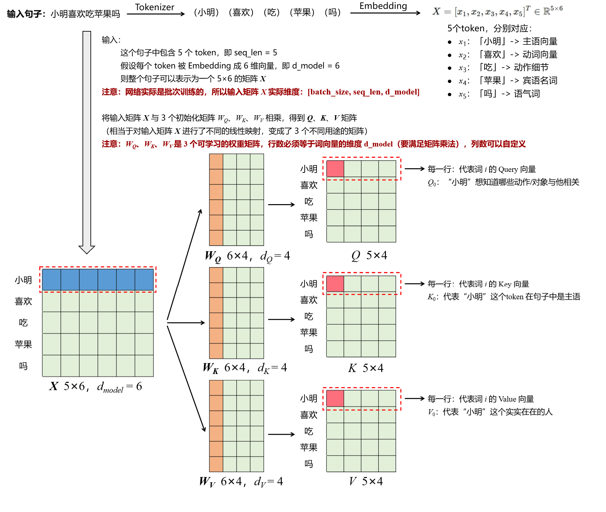

对于这个例子来讲，Q/K/V矩阵的每一行代表的含义如下：

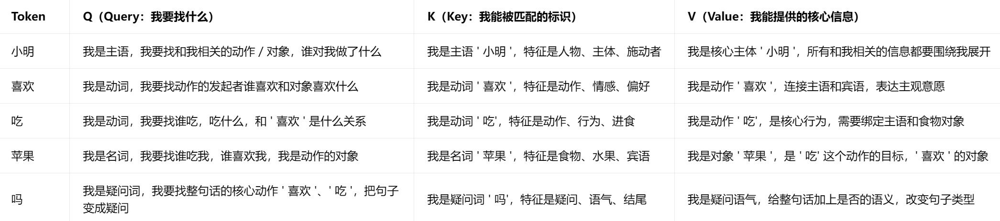


✨ **多头注意力机制 = 从多个角度观察同一个句子，每个头学习不同的关系，最终把所有信息整齐起来，让每个 token 表示更丰富**

核心思想：先把 Q/K/V 矩阵通过`「线性映射」`到多个子空间，然后在每个子空间中`「单独计算注意力」`，最后把每个头的输出`「拼接起来」`

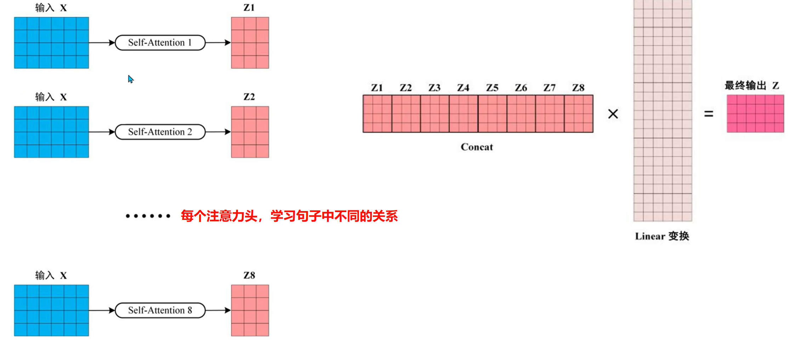

## 三、Transformer架构

✨ **Transformer 最开始被发明的时候，只是为了“机器翻译”任务，并不是为了大模型而生的**

想让模型学会翻译，从直觉上也能知道，肯定需要 “原文” 和 “译文” 两种数据，因此 Transformer 架构，有两种输入数据

* 原文：被输入到「编码器」中，转换成 “向量”，从而能被网络理解出句子的意思，因此叫做「编码器」
* 译文：被输入到「解码器」中，参照 “原文” 来翻译出句子，因此叫「解码器」

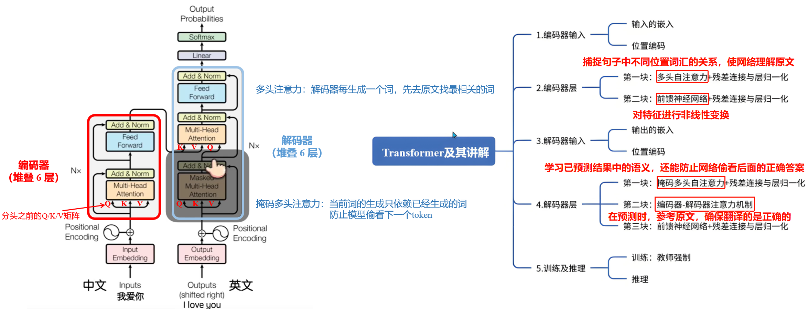


解码器虽然也被堆叠了 6 层，但是输入的 ”原文“ 信息都是一样的，都来源于编码器的输出

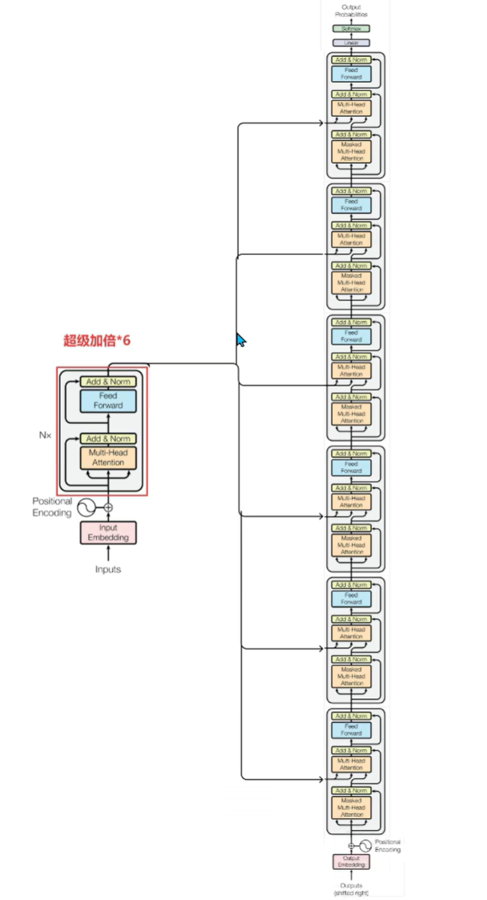

✨ **以中译英任务为例：**

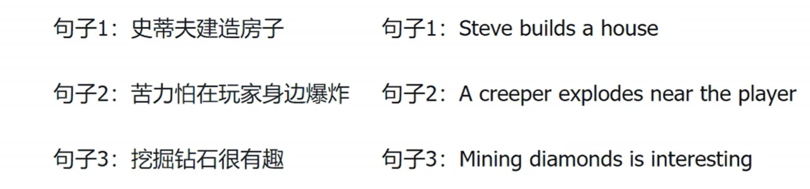

### 3.1 编码器

✅ **输入层处理：分词 + 词嵌入 + 位置编码**

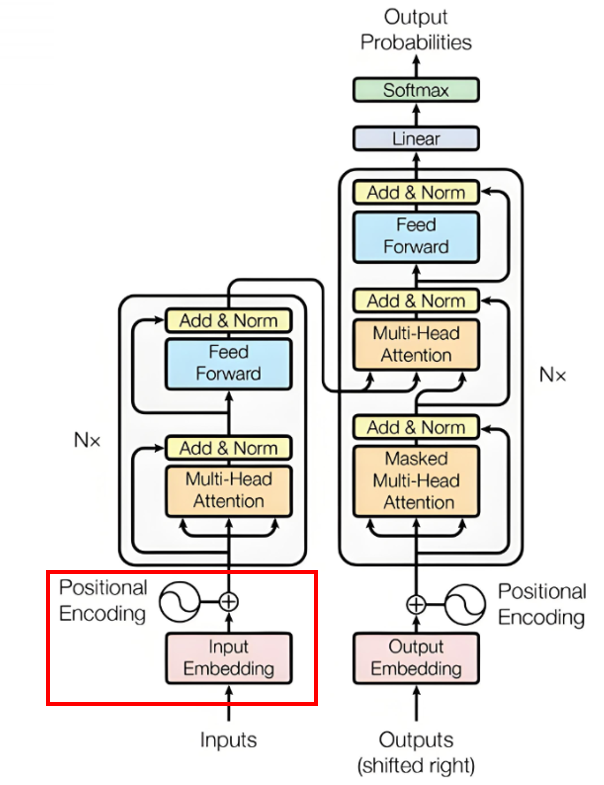

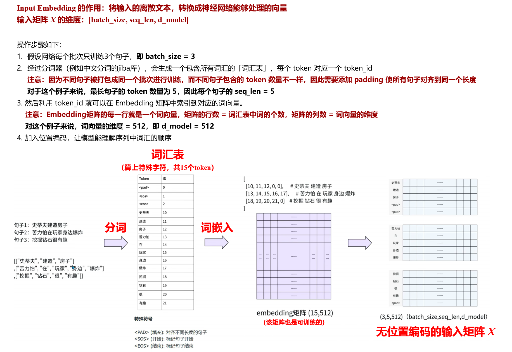

**加入位置编码的原因：**注意力机制的输出是”无序的“，它不关注句子词汇的顺序，因此必须 ”手动“ 注入词汇的位置信息/顺序信息

核心操作：把位置编码向量**直接加到输入矩阵上**（维度相同，逐元素相加），最终得到 “语义 + 位置” 的输入向量。

> 数学本质：Q/K/V 的输出是带权重的加法，符合交换律，如果不带位置编码，则无论怎么调整句子中 token 的顺序，注意力的输出都是一样的。但很显然 `“我爱你”` 和 `“你爱我”` 这句话的语义是不一样的，因此必须加入位置编码，使这两个句子的注意力输出不一样


原始的 Transformer 架构，采用 `「正余弦编码」` 来计算位置信息

* pos：词在句子中的位置，从 0 到 seq_len - 1
* d~model~：词对应的 embedding 向量的维度，固定值，例如 512
* i：embedding 向量中的每个维度，从 0 到 d~model~/2 - 1

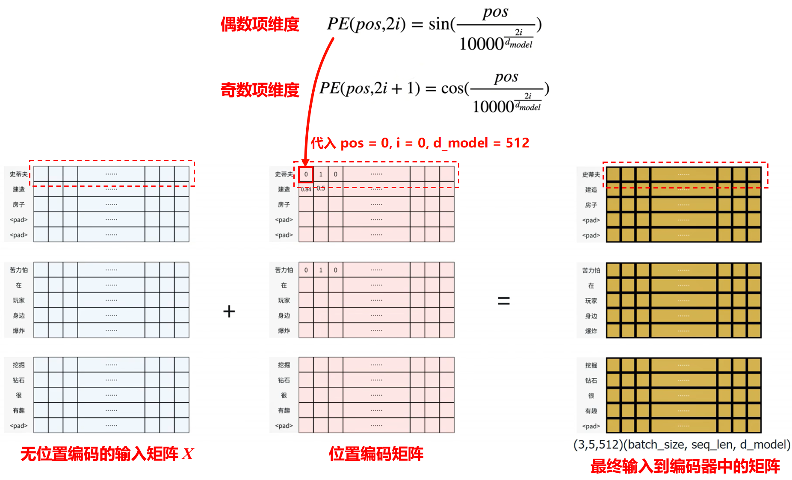

> 正余弦编码的缺点：将位置编码直接叠加到输入矩阵 X，会直接污染整个 X，并且这个位置编码是不可学习的
>
> 目前已经衍生出了各种各样的位置编码，例如旋转位置编码 RoPE


接下来，携带者位置信息的输入矩阵，就会进入编码器层，让模型理解句子的含义！

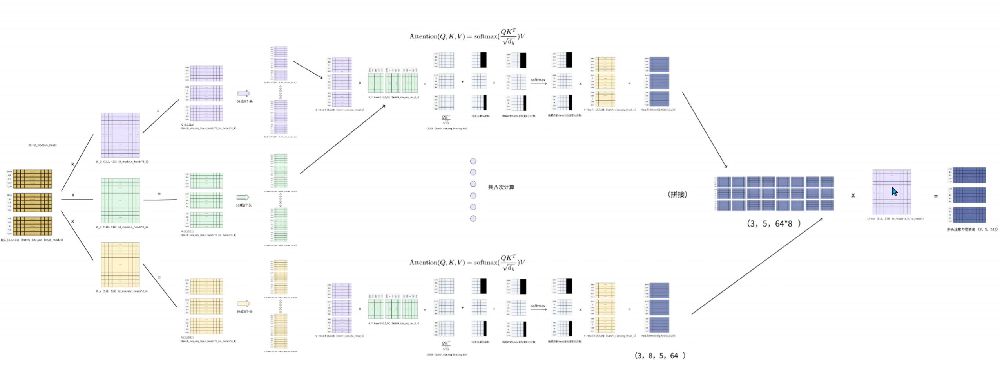

✅ **多头自注意力机制：分出 8 个头**

首先会经过 「多头自注意力机制」计算 Q/K/V 矩阵

下面以 K 矩阵为例：输入矩阵 *X* 通过 *W*~K~ 相乘，再经过「分头操作」能获得多个小的 K 矩阵

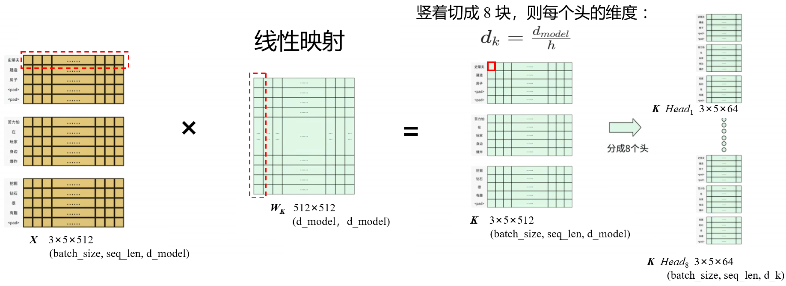

同理，输入矩阵 *X* 通过 *W*~Q~、*W*~V~ 相乘，再经过「分头」操作，也能分别得到 8 个 小的 Q/K 矩阵


✅ **多头自注意力机制：每个头各自执行注意力分数计算**

⚠️ 注意：先前为了让每个句子对齐到同一长度，在短句的末尾补了占位符 PAD，但 PAD 本身没有实际语义，因此必须让模型 “忽略” PAD

🌟 比较常用的做法是给 PAD 的位置加上一个很大的负数，-1e9，这样经过 softmax 之后，这个位置的注意力分数就趋于 0


✅ **多头自注意力机制：多头拼接**

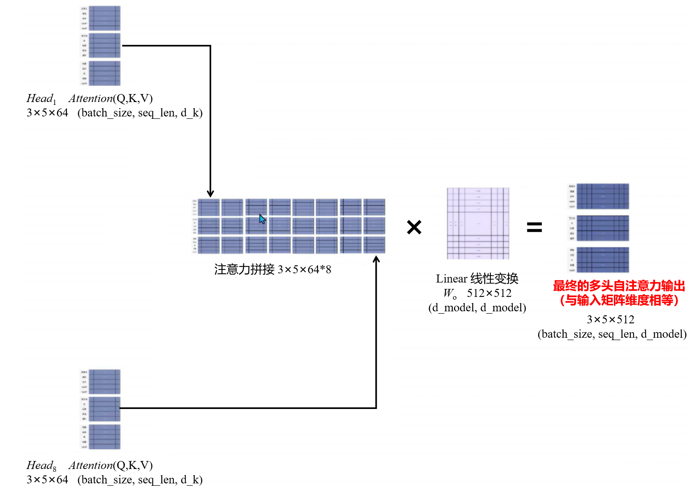

✅ **多头自注意力机制：残差与层归一化**

🌟 为什么需要残差？

* **信息传递**：「当前层的输入」（Input）可以 “直接加到” 「当前层的输出」（SubLayerOutput）上，不管层多深，原始信息都能一路传递下去，不会被深层的复杂变换 “淹没”
* **梯度传递**：反向传播时，梯度不仅能通过 `SubLayerOutput` 路径传递，还能通过 `Input` 这条 “直路” 直接传到浅层，彻底解决梯度消失问题

🌟 为什么需要层归一化？

* 规范化特征，使训练快速收敛，提高模型稳定性

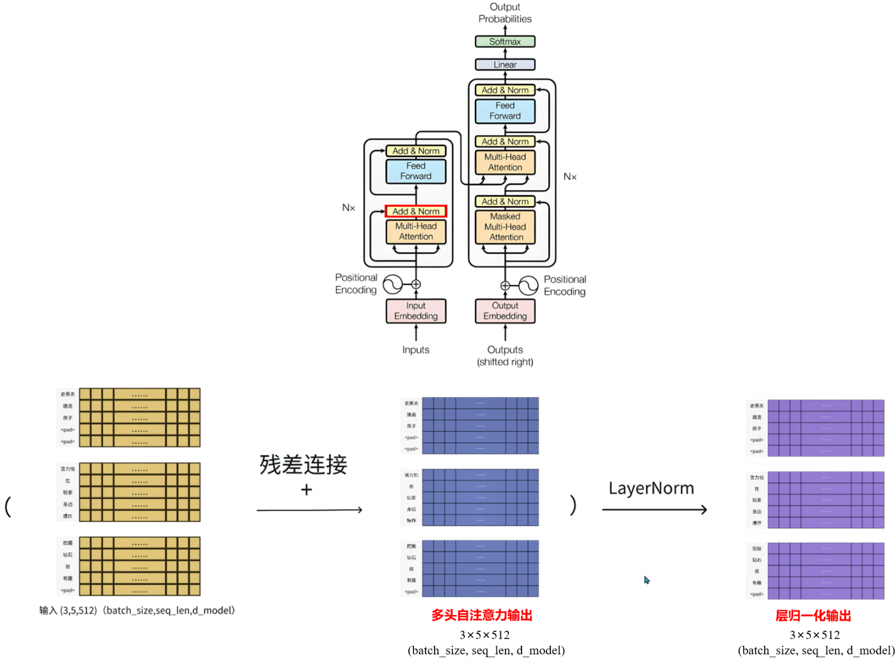


✅ **FFN 前馈神经网络**

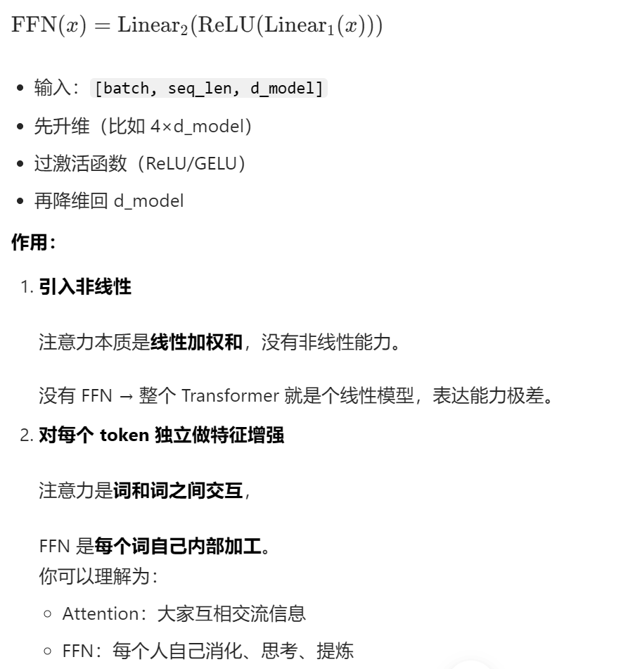


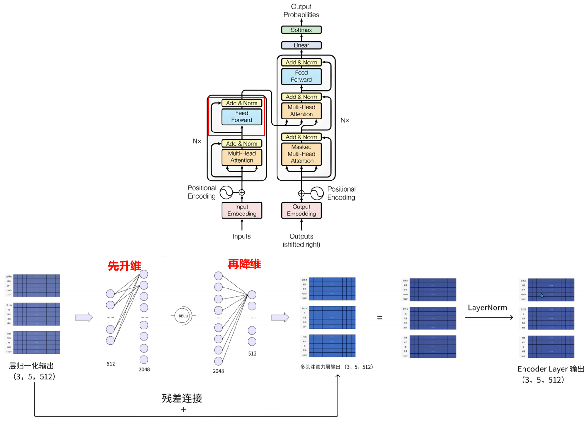

### 3.2 解码器

✅ **输入层处理：分词 + 词嵌入 + 位置编码**

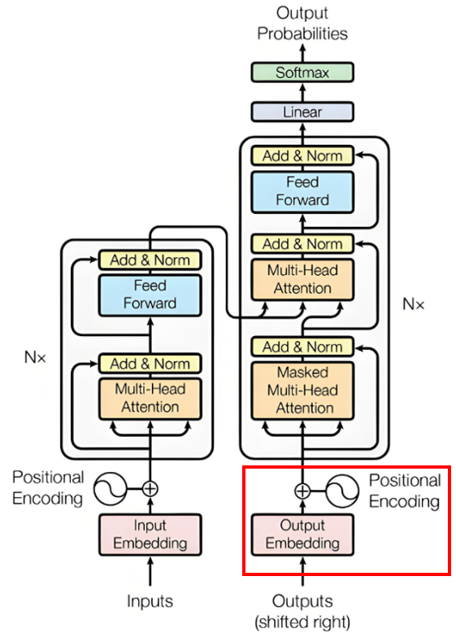

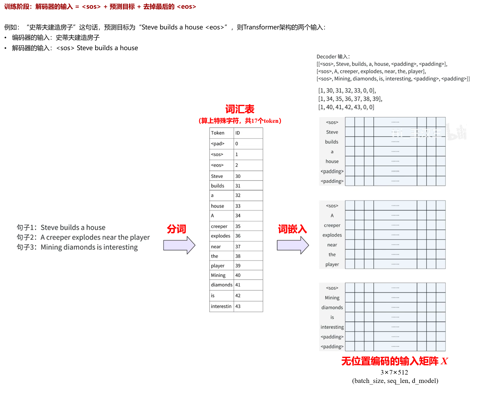

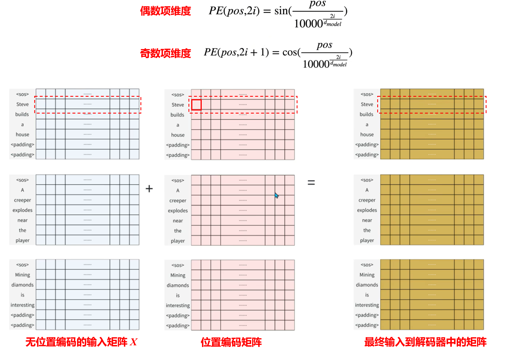

✅ **解码器预测过程：自回归生成（用已生成的词预测下一个）+ 掩码遮未来（只能看左边）+ 多头自注意力对齐原文（保证翻译准确）**

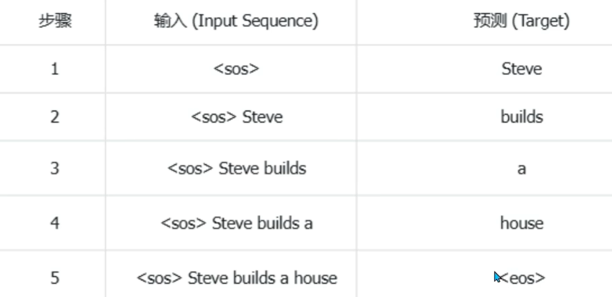

**第一步：用 `<sos>` 预测第一个词「Steve」**

* **当前解码器输入**：仅 `<sos>`（生成的起点，无其他词）

* **掩码作用**：Masked Attention 只让 `<sos>` 看到自己（无未来词，权重全集中在自身）

* **核心计算逻辑**：

  - Masked Attention：`<sos>` 仅对自身计算注意力

  - Encoder-DecoderAttention：`<sos>` 去编码器的中文语义向量里找最相关的 Token —— 编码器中「史蒂夫」是专有名词，语义特征最突出，因此注意力权重几乎全集中在「史蒂夫」上

* **输出结果**：通过输出层（Linear+Softmax）计算所有英文词的概率，「Steve」概率远高于其他词，预测出第一个词

**第二步：用 `<sos> Steve` 预测第二个词「builds」**

* **当前解码器输入**：`<sos> Steve`（拼接第一步生成的 Steve）

* **掩码作用**：

  - `Steve` 能看到 `<sos>` 和自己（下三角掩码允许左向查看）

  - `<sos>` 仍只能看到自己

* **核心计算逻辑**：

  - Masked Attention：`Steve` 关注 `<sos>`和自己，建模 “专有名词 + 起始符” 的语序逻辑
  - Encoder-DecoderAttention：`Steve` 除了关联编码器的「史蒂夫」，还会重点对齐「建造」，匹配上 “builds”

* **输出结果**：「builds」概率最高，预测出第二个词

**第三步、第四步：依次预测出 a house**

**第五步：用 `<sos> Steve builds a house` 预测结束符 `<eos>`**

* **当前解码器输入**：`<sos> Steve builds a house`（拼接第四步生成的 house）

* **核心计算逻辑**：

  - Masked Attention：`house` 关注前面所有词（`<sos> Steve builds a`），确认 “主谓宾” 结构完整

  - Encoder-DecoderAttention：遍历编码器所有中文 Token（史蒂夫 / 建造 / 房子），确认所有语义都已翻译完成

* **输出结果**：`<eos>`（结束符）概率最高，模型停止生成

> 推理过程如上所示，但是训练过程稍微有点不大一样！
>
> 因为训练过程中，如果模型有一步预测错了，则一步错，步步错，错误会被一直传递下去，这显然是不合适的
>
> 因此训练过程中，会引入“教师强制策略”，即在每一步的训练过程中，完全无视模型上一步的实际输出，直接将正确答案作为预测下一个词的输入。例如，模型在第一步就将「Steve」误预测成了「Bob」，模型依旧会把正确答案「Steve」拼接到下一步的预测


✅ **掩码多头自注意力/Masked Attention**

正如上面所说，「解码器」对句子进行预测时，为了防止模型作弊，不能让模型看到下一个正确的 token

而在模型训练时，我们又不可能每次都把上一次的输出，作为下一次的输入，这样一次一次重复输入，训练速度太慢了

所有我们实际上是把整个正确的句子 `<sos> Steve builds a house` 直接输入给网络，**同时为了防止模型看到下一个词，需要引入掩码！**

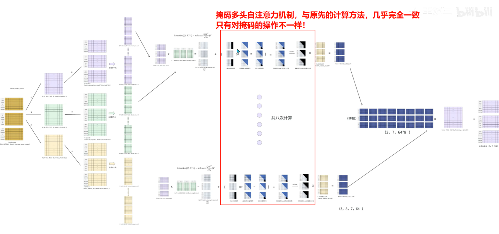

前面的操作都是一样的，因此这里从 `第一个头` 的注意力计算开始讲起

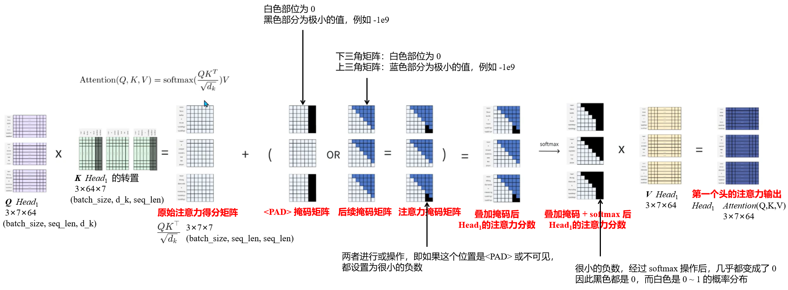

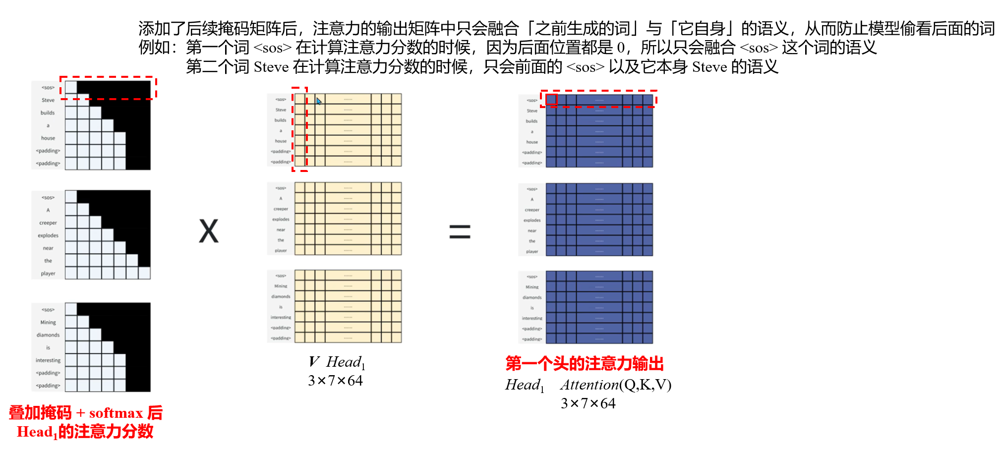

✅ **编码器-解码器自注意力/Encoder-DecoderAttention**

这个位置才是翻译真正开始的地方，工作方式如下：

* 「解码器」将当前正在生成的词作为 Query
* 「编码器」输出的整个句子作为 Key/Value
* 因此「解码器」在生成每个词的时候，都可以 “查询” 输入句子中的哪些词语最相关！

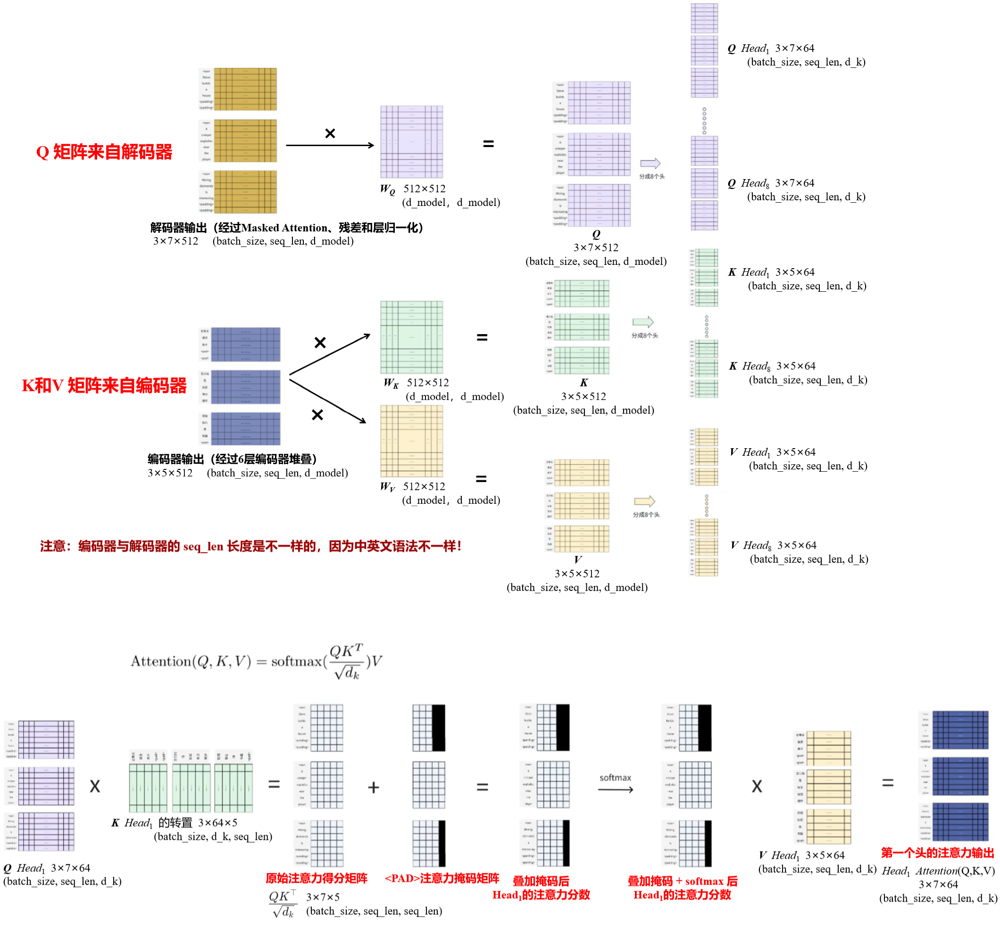

### 3.3 输出预测

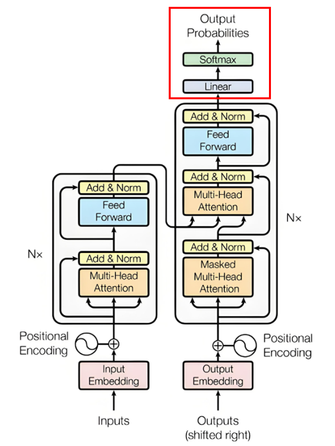


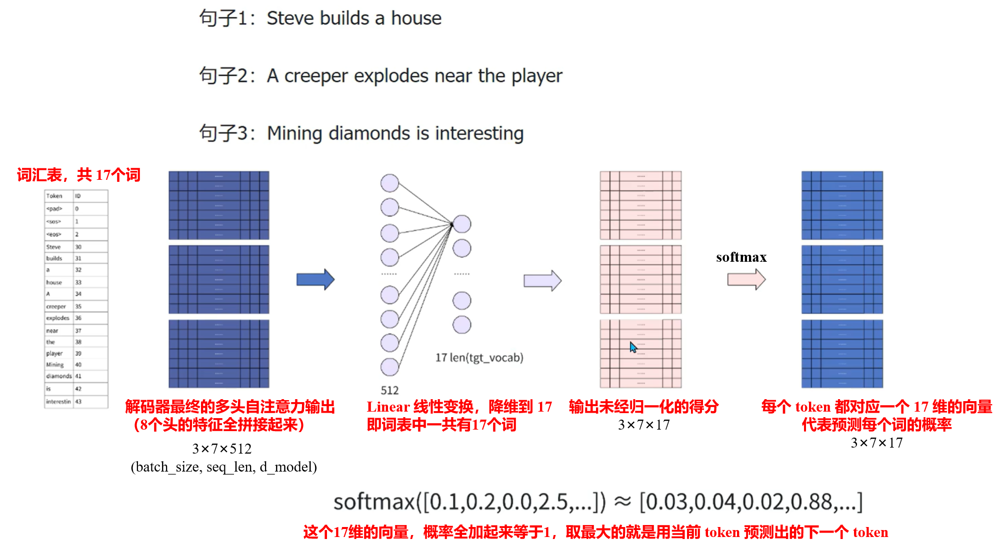


### 3.4 LN层归一化 or BN批归一化

> 区别：切蛋糕的方向不一样

✅ **BN 批归一化：计算不同批次的统一位置**

对于 Transformer 架构中，不同批次就是不同的句子，同一个位置是不同的词，两者没有任何关系

所以一般 Transformer 架构中不会用 BN 批归一化

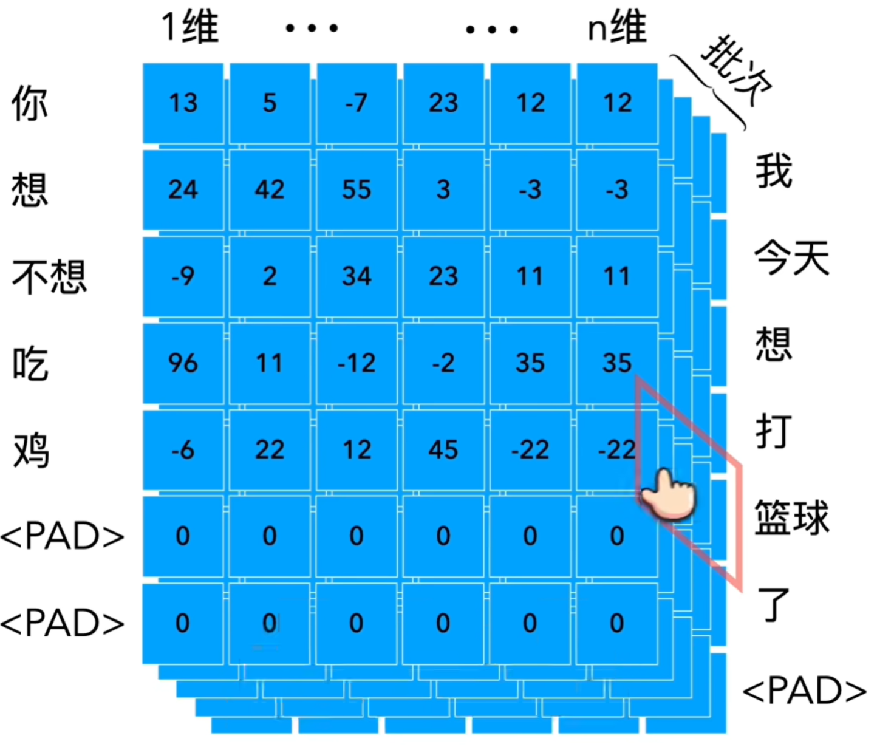

✅ **LN 层归一化：计算不同批次的统一位置**

只对每个词的内部作归一化，只管自己，不会看其他词和句子，因此也不会影响别人

所以很适合 Transformer 架构 `处理不同长度句子` 的需求

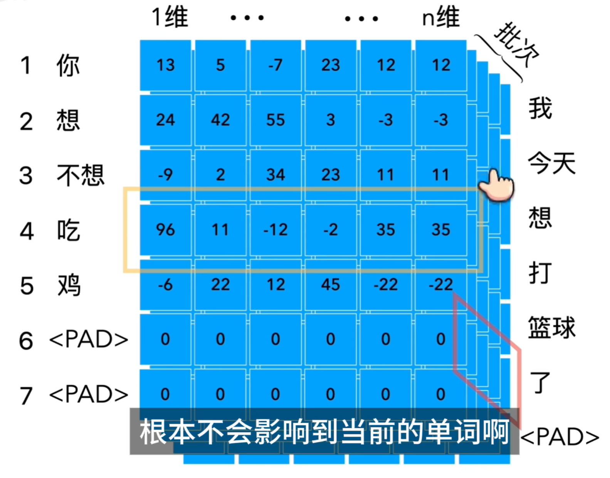

### 3.5 旋转位置编码

[旋转位置编码](https://www.bilibili.com/video/BV1FjrCBdESo/?spm_id_from=333.337.search-card.all.click)


