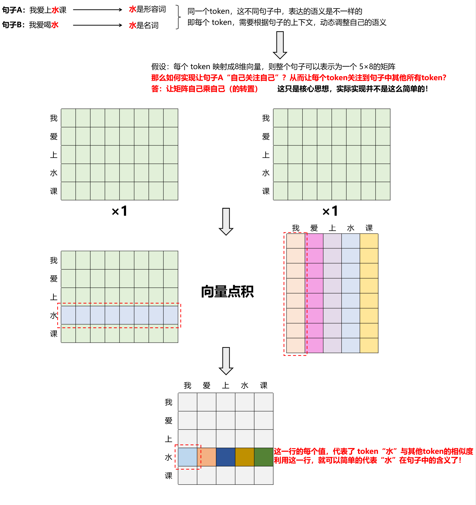

# Transformer 学习

## 一、注意力机制

### 1.1 向量点积&语义相似度

✨ **注意力机制的核心：向量相似度 -> 语义相似度**

因为机器是看不懂文字的，如果想让机器去理解每个词语的意思，就需要一个模型`（Embedding模型）`把这些词语`（token）`转化成 `向量`

> 对于中文来讲，一个 token 可以是一个词语，也可以是一个字，它是具有独立语义的单位

`「向量点击」`是衡量`「语义相似度」`的一种量化方式

举例说明：

### 1.2 向量点积&自注意力

✨ **自注意力（Self-Attention）的核心：让每个 token 根据上下文动态调整自己的语义表示**

自注意力，顾名思义就是：**句子 A → 关注 → 句子 A（自身）**

目的：让 `「每个 token」` 都能与当前句子中的`「其他所有 token」`进行“信息交互”，使其成为融合了上下文信息的新语义表示

举例说明：

### 1.3 注意力机制中的 Q、K、V 矩阵