# Transformer 学习

## 一、神经网络基础

### 1.1 神经元的本质

✨ **神经元的本质：描述输入和输出关系的数学函数！**

\[
y = \sigma(W \cdot X + b)
\]

其中：

* *`W `*为权重矩阵
* *`X`* 为输入矩阵
* *`b`* 为神经元的偏置（如果没有此项，则函数只能拟合`输入为0时，输出也为0` 的线性关系，因此无法拟合任意的线性关系）
* *`σ`* 为激活函数（让网络拥有拟合非线性函数的能力）

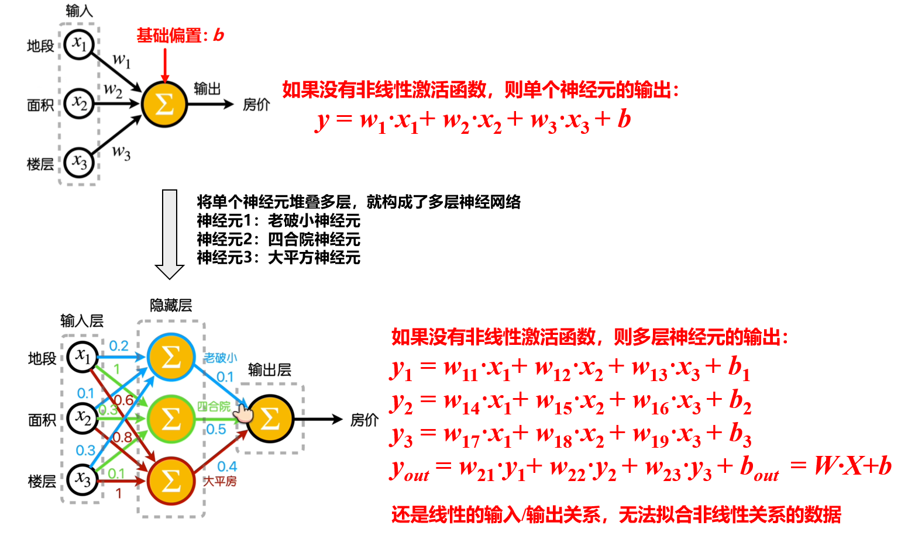

✨ **为了让神经网络可以拟合非线性关系的数据，因此可以在每层神经元后面加上一个激活函数，引入非线性！**

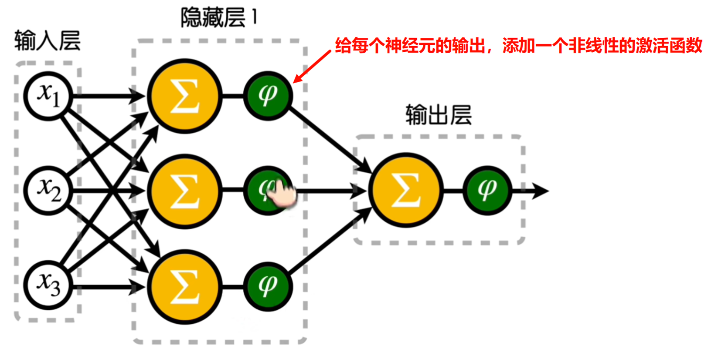

✅ 曾经的激活函数之王：Sigmoid

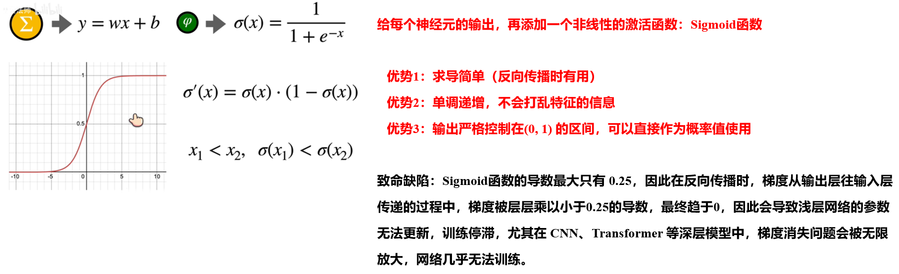

✅ 目前常用的激活函数：Relu

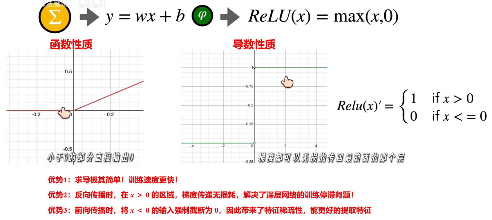

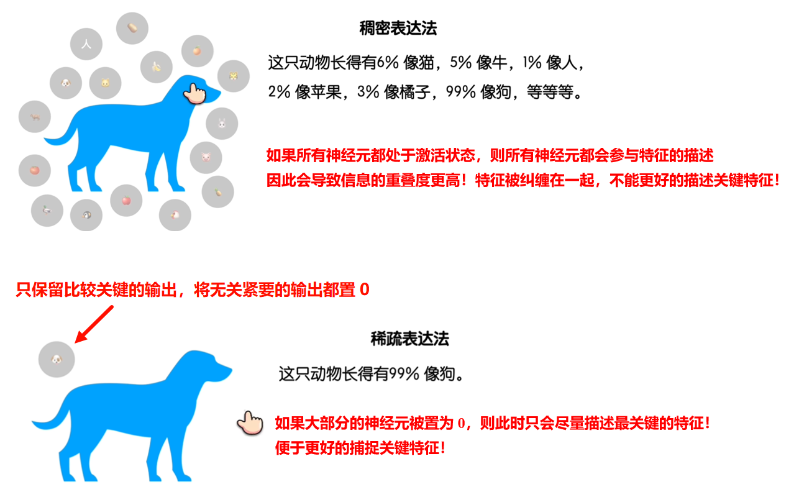

### 1.2 反向传播与梯度下降

> 反向传播 = 计算梯度
>
> 梯度下降 = 根据算出来的梯度去更新模型参数

✨ **函数拟合与梯度下降的关系**

假设有一个任务是根据 `房子的面积` 去预测 `房子的价格`，其实计算输入和输出的函数表达式！

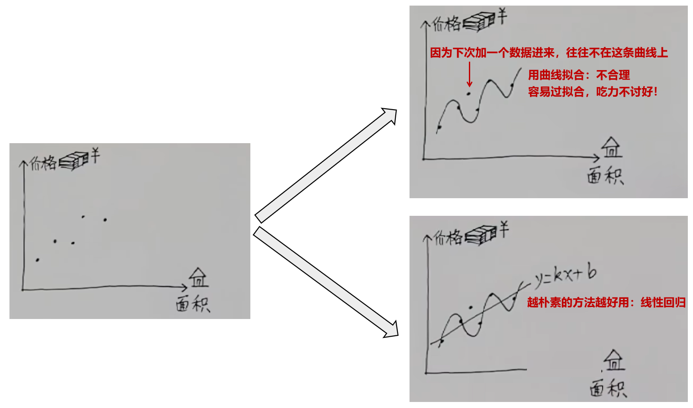

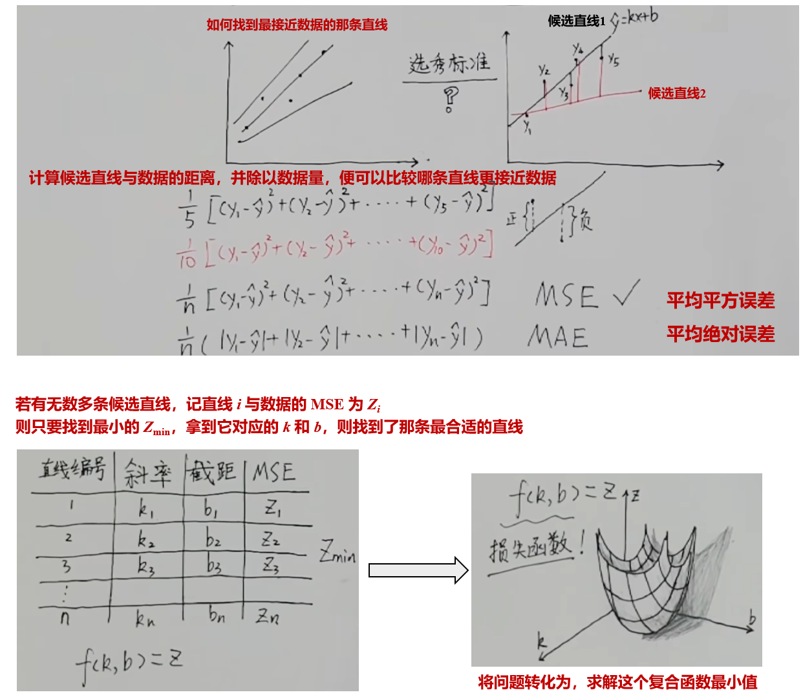

先理解上山，再理解下山！

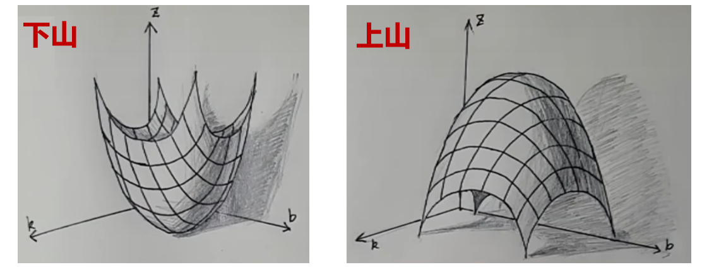

在二维平面中：

* 可以根据 `导数的正负性`，寻找上山的路！
* 可以直接用 `导数的大小`，作为上山的步长!

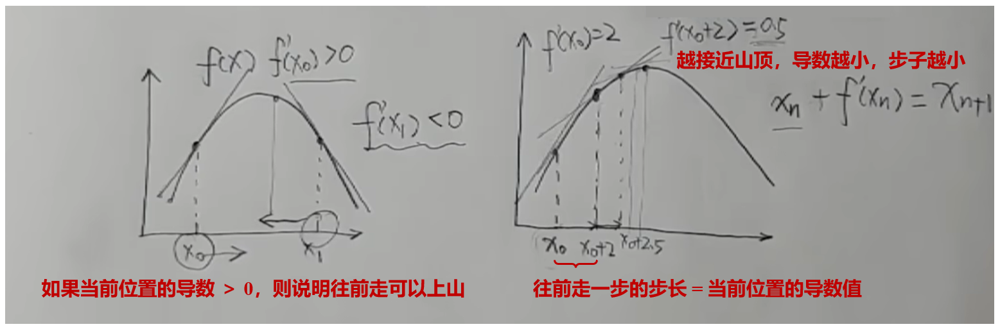

特殊情况：

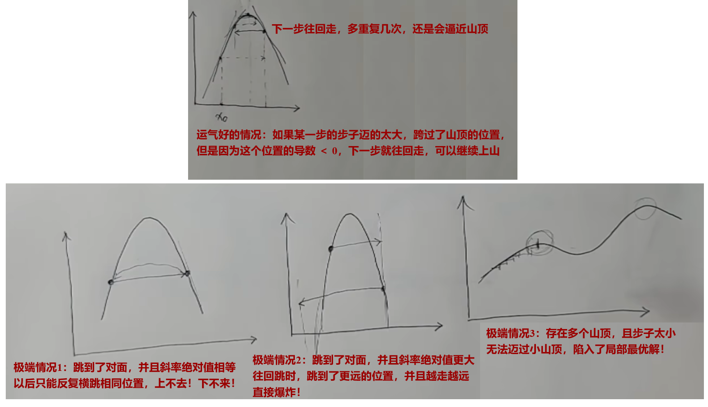

为了解决上述的极端情况，通常会在每次的步长前面乘以一个变量，动态调整每次的步长，这个变量就称为 `学习率`

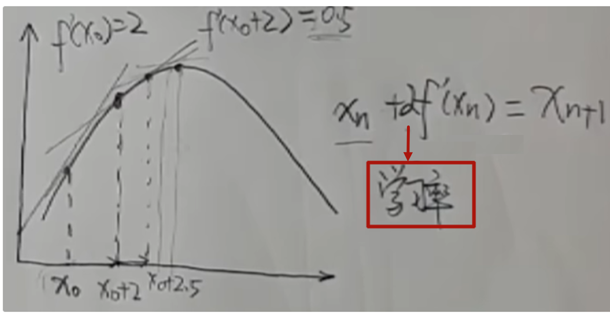

因此，对于二元函数构成的 3 维空间，要找上山的路，需要对 2 个变量分别求偏导数，这两个偏导数分别对应了 2 个方向上要走的步长

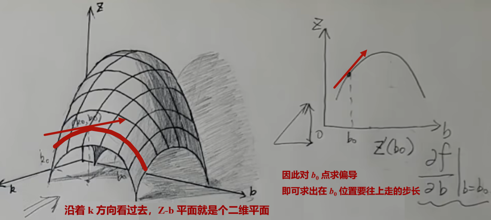

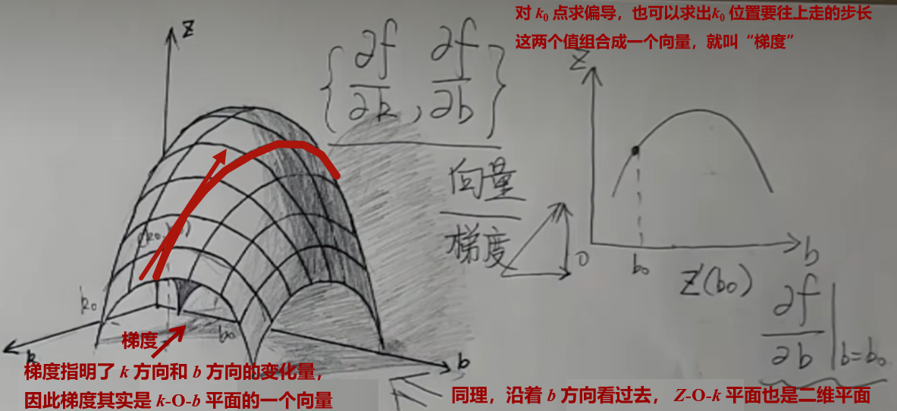

> 上山举例：假设你当前所在的位置为 (1, 2)，当前位置的梯度为（2， 3），则如果你要上山的话，下一步的位置为（3，5）

知道了上山的步骤，下山就更简单了，只需要给梯度乘个-1，让他反方向走，就能一步一步走到最低的点

> 上山举例：假设你当前所在的位置为 (1, 2)，当前位置的梯度为（2， 3），则如果你要下山的话，下一步的位置为（1-2，2-3）

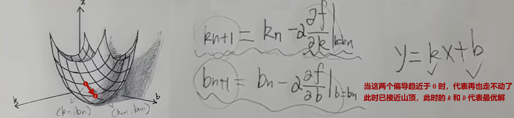

✨ **反向传播：计算模型中所有可学习参数的梯度（偏导数）**

✅ 第一步：搭建神经网络模型

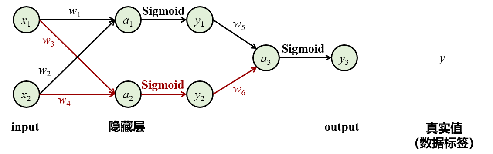

✅ 第二步：前向传播
$$
\begin{align*}
a_1 &= w_1 \cdot x_1 + w_2 \cdot x_2 + b_1 &\quad y_1 &= \frac{1}{1+e^{-a_1}} \\
a_2 &= w_3 \cdot x_1 + w_4 \cdot x_2 + b_2 &\quad y_2 &= \frac{1}{1+e^{-a_2}} \\
a_3 &= w_5 \cdot z_1 + w_6 \cdot z_2 + b_3 &\quad y_3 &= \frac{1}{1+e^{-a_3}}
\end{align*}
$$

✅ 第三步：反向传播

**1. 选择合适的损失函数**

`如果每次只训练一个样本，用 MSE 作为损失函数：`
$$
L = \text{MSE} = \frac{1}{2} \left( \hat{y} - y \right)^2 = \frac{1}{2} \left( {y}_3 - y \right)^2
$$

* *ŷ*：模型预测值，对应当前模型的 *y~3~*（比如这张图片是狗的概率 = 0.95）
* *y*：真实值（如果这张图片真是狗，则标签为 1，否则标签为 0）
* 1/2：实际的 MSE 是不需要除以 2 的，这里纯粹是为了简化反向传播时的计算

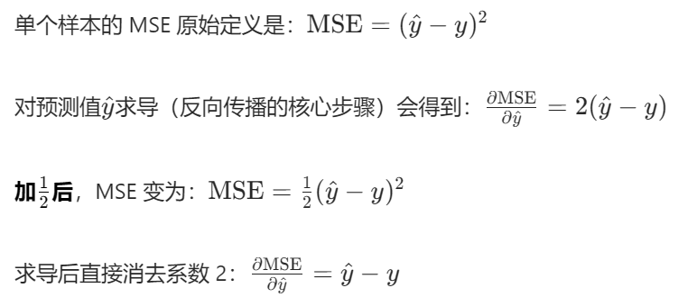

`如果每次训练 N 个样本，用 MSE 作为损失函数：`
$$
L = \text{MSE} =  \frac{1}{N} \sum_{i=1}^{N} \left( \hat{y}_i - y_i \right)^2
$$

* *ŷ*：模型预测值
* *y*：真实值
* *N*（batch_size ）：本次训练的样本数量

> 比如：训练数据是 5 套房子的交易信息**（5 个样本，N=5）**，每套房子都用 3 个特征描述**（3 个输入变量，*x*~1~、*x*~2~、*x*~3~）**
>
> 网络会对这 5 个样本分别做前向传播得到 5 个预测值 *ŷ*，再和 5 个真实值 *y* 计算 MSE（除以 5）

**2. 计算所有可训练参数的梯度，即对所有输入变量求偏导**

这个神经网络里所有可训练参数为：权重*w*~1~、*w*~2~、*w*~3~、*w*~4~、*w*~5~、*w*~6~，以及偏置*b*~1~、*b*~2~、*b*~3~）
$$
\begin{cases}
\frac{\partial L}{\partial w_6} = \frac{\partial L}{\partial y_3} \cdot \frac{\partial y_3}{\partial a_3} \cdot \frac{\partial a_3}{\partial w_6} = a \\
\frac{\partial L}{\partial w_5} = \frac{\partial L}{\partial y_3} \cdot \frac{\partial y_3}{\partial a_3} \cdot \frac{\partial a_3}{\partial w_5} = b \\
\frac{\partial L}{\partial w_4} = \frac{\partial L}{\partial y_3} \cdot \frac{\partial y_3}{\partial a_3} \cdot \frac{\partial a_3}{\partial y_2} \cdot \frac{\partial y_2}{\partial a_2} \cdot \frac{\partial a_2}{\partial w_4}= c \\
\frac{\partial L}{\partial w_3} = \dots = d \\
\frac{\partial L}{\partial w_2} = \dots = e \\
\frac{\partial L}{\partial w_1} = \dots = f \\
\end{cases}
$$

$$
\begin{cases}
\frac{\partial L}{\partial b_3} = \frac{\partial L}{\partial y_3} \cdot \frac{\partial y_3}{\partial a_3} \cdot \frac{\partial a_3}{\partial b_3} = g \\
\frac{\partial L}{\partial b_2} = \frac{\partial L}{\partial y_3} \cdot \frac{\partial y_3}{\partial a_3} \cdot \frac{\partial a_3}{\partial y_2} \cdot \frac{\partial y_2}{\partial a_2} \cdot \frac{\partial a_2}{\partial b_2}= h \\
\frac{\partial L}{\partial b_1} = \frac{\partial L}{\partial y_3} \cdot \frac{\partial y_3}{\partial a_3} \cdot \frac{\partial a_3}{\partial y_1} \cdot \frac{\partial y_1}{\partial a_1} \cdot \frac{\partial a_1}{\partial b_1}= i
\end{cases}
$$

**3. 利用梯度下降法，更新参数**

其中：*α* 为学习率
$$
\begin{cases}
{w}_6 = {w}_6 - \alpha \cdot \frac{\partial L}{\partial w_6} = {w}_6 - \alpha \cdot {a} \\
{w}_5 = {w}_5 - \alpha \cdot \frac{\partial L}{\partial w_5} = {w}_4 - \alpha \cdot {b} \\
{w}_4 = {w}_4 - \alpha \cdot \frac{\partial L}{\partial w_4} = {w}_4 - \alpha \cdot {c} \\
{w}_3 = {w}_3 - \alpha \cdot \frac{\partial L}{\partial w_3} = {w}_3 - \alpha \cdot {d} \\
{w}_2 = {w}_2 - \alpha \cdot \frac{\partial L}{\partial w_2} = {w}_2 - \alpha \cdot {e} \\
{w}_1 = {w}_1 - \alpha \cdot \frac{\partial L}{\partial w_1} = {w}_1 - \alpha \cdot {f} \\
{b}_3 = {b}_3 - \alpha \cdot \frac{\partial L}{\partial b_3} = {b}_3 - \alpha \cdot {g} \\
{b}_2 = {b}_2 - \alpha \cdot \frac{\partial L}{\partial b_2} = {b}_2 - \alpha \cdot {h} \\
{b}_1 = {b}_1 - \alpha \cdot \frac{\partial L}{\partial b_1} = {b}_1 - \alpha \cdot {i} \\
\end{cases}
$$

## 二、注意力机制

### 2.1 向量点积&语义相似度

✨ **注意力机制的核心：向量相似度 -> 语义相似度**

因为机器是看不懂文字的，如果想让机器去理解每个词语的意思，就需要一个模型`（Embedding模型）`把这些词语`（token）`转化成 `向量`

> 对于中文来讲，一个 token 可以是一个词语，也可以是一个字，它是具有独立语义的单位

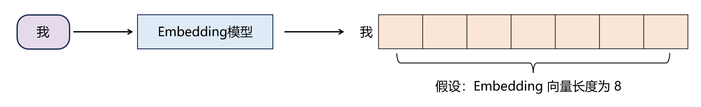

`「向量点击」`是衡量`「语义相似度」`的一种量化方式

举例说明：

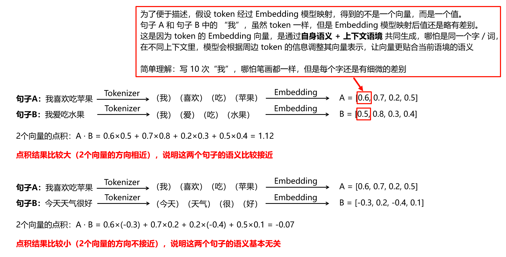

### 2.2 向量点积&自注意力

✨ **自注意力（Self-Attention）的核心：让每个 token 根据上下文动态调整自己的语义表示**

自注意力，顾名思义就是：**句子 A → 关注 → 句子 A（自身）**

目的：让 `「每个 token」` 都能与当前句子中的`「其他所有 token」`进行“信息交互”，使其成为融合了上下文信息的新语义表示

举例说明：

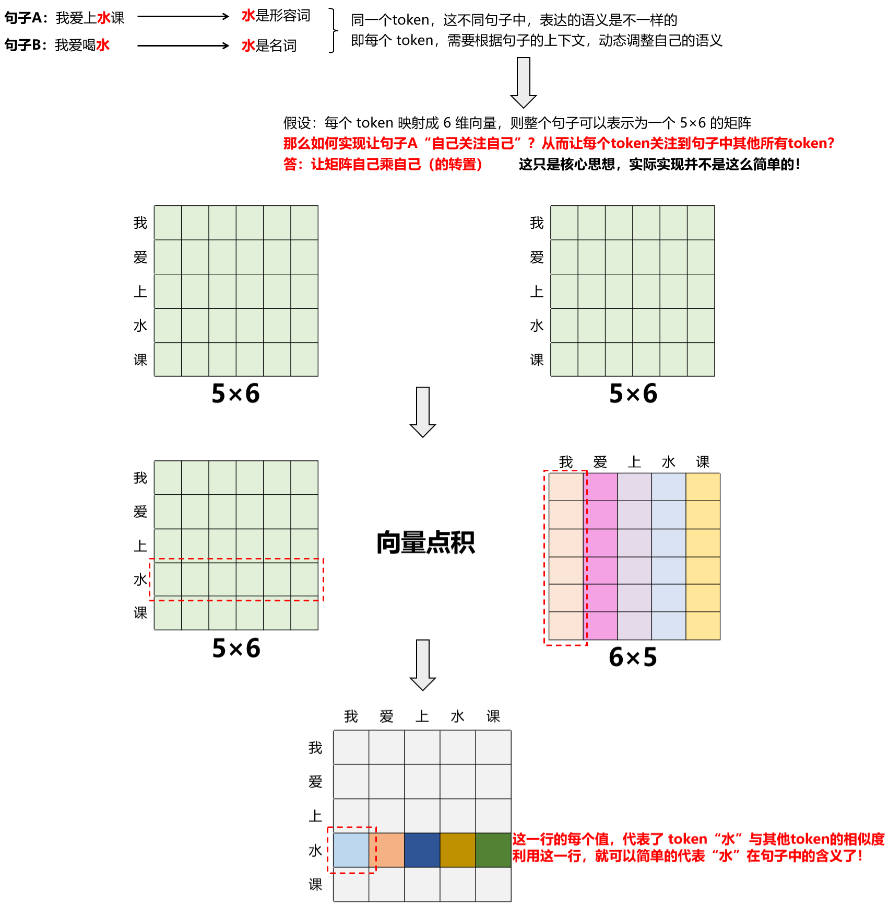

### 2.3 自/多头注意力机制中的 Q、K、V 矩阵

> 1.2 小节中的计算方法太简单粗暴了，实际实现并不是这样的，接下来详细介绍Q、K、V矩阵

**自注意力机制（Self-Attention）**、**多头注意力（Multi-Head Attention）** 的核心三要素，就是 Q、K、V 矩阵

本质是通过 **向量映射 + 相似度计算** 让模型在处理句子时，能够自适应地关注不同位置的信息，最终加权融合出有意义的输出
\[
\text{Attention}(Q, K, V) = \text{Softmax}\left( \frac{QK^T}{\sqrt{d_k}} \right) V
\]

- **Q (Query，查询)**：当前位置的 “问题”—— 模型想从序列中**找什么？**
- **K (Key，键)**：序列中每个位置的 “答案标签”—— 模型**有什么信息**可以匹配
- **V (Value，值)**：序列中每个位置的 “答案内容”—— 匹配后**实际要使用的信息**

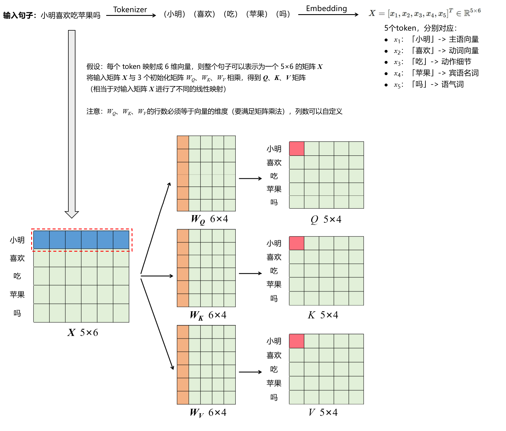

